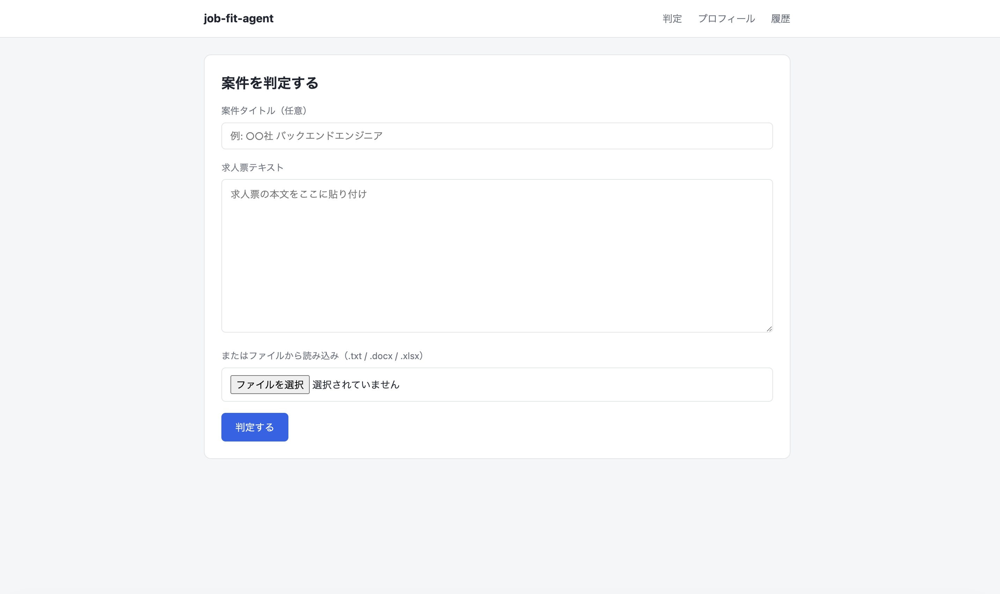

# job-fit-agent

案件探しで「必須スキルを何十件も目grepして、当落線上の案件に時間を溶かす」のをやめるために作った、Claudeを使った案件適合度判定エージェント。スキルシートと求人票を渡すと、技術スキルと働き方の希望条件の両面から適合度を判定し、そのまま送れる応募文まで自動生成する。

## なぜ作ったか

フリーランス/業務委託エンジニアの案件探しは、求人票を開いて必須スキルを1行ずつ照合し、稼働条件（リモート可否・単価・常駐有無）を確認し、見送るか応募文を書くかを判断する、という単調な作業の繰り返しになりがち。この判断を毎回自分の頭でやる代わりに、スキルシートと希望条件を一度登録しておけば、求人票を貼るだけで「応募すべきか」「どこにギャップがあるか」「何を書いて送るか」まで出てくるようにした。

## できること

- **技術スキルの適合度判定** — 求人票の必須/歓迎条件ごとに、スキルシートの内容から満たしているかを○/△/×で判定（根拠つき、憶測では判定しない）。「○年程度の経験」のような年数要件は、スキルシート上の実務年数を数値として抽出し、要求年数との比率で機械的に○/△/×を算出する（LLMの言葉づかいのブレに判定基準が左右されないようにしている）
- **働き方の希望条件との合致判定** — フルリモート/一部リモート/常駐の許容範囲、週の希望稼働日数、希望単価レンジ（時給）、リーダー/PMポジションの可否などをチェックボックス・ドロップダウンで登録し、求人票の勤務条件と照合。フルリモート希望なのに出社必須、のような重大な不一致は総合スコアに反映される
- **懸念点の言語化** — 経験年数不足、単価レンジのズレなど、応募前に確認すべき点を具体的に指摘
- **確認質問の自動生成** — 「フルリモート希望だが求人票の記載が曖昧」のように、求人票の記載だけでは判断がつかない懸念点については、案件担当者にそのまま聞ける具体的な質問文を生成
- **応募文の自動生成** — スキルシートから関連経験を選んで、そのまま送れる応募文を作成
- **判定履歴** — 過去に判定した案件を一覧で振り返れる

## スクリーンショット



## 技術スタック

- Python 3.13 / FastAPI / Jinja2（サーバーサイドレンダリング、フレームワークレスなフロント）
- Anthropic API（Claude Sonnet 5）。判定結果はプロンプトでJSONを頼んで正規表現でパースするような壊れやすい方式ではなく、tool useを強制（`tool_choice`）してJSON Schema通りの構造化データとして受け取っている
- openpyxl / python-docx（Excel・Wordのスキルシートからのテキスト抽出）
- ruff（lint）

## セットアップ

```bash
python3 -m venv .venv
.venv/bin/pip install -r requirements.txt
cp .env.example .env  # ANTHROPIC_API_KEY を設定
```

開発時（lintを使う場合）は代わりに `requirements-dev.txt` を使う。

```bash
.venv/bin/pip install -r requirements-dev.txt
```

## 起動

```bash
.venv/bin/uvicorn app.main:app --reload
```

http://127.0.0.1:8000 を開く。

## 使い方

1. `/skill-sheet` で自分のスキルシート（.xlsx / .docx / テキスト）と働き方の希望条件（フルリモート希望/出社不可など）を登録する（初回のみ、以後は使い回し）
2. トップページで求人票のテキストを貼り付け（またはファイルを選択）て「判定する」
3. 適合度スコア・必須/歓迎スキルの○×判定・働き方の希望条件との合致度・懸念点・確認したいこと・応募文が表示される
4. 判定結果は `/history` に蓄積される

スキルシート・働き方の希望条件・判定履歴は `data/` にローカル保存されます。

判定時には、求人票・スキルシート・働き方の希望条件のテキストのみをClaude APIへ送信します。

`data/` と `.env` はgit管理対象外です。

## Lint

```bash
.venv/bin/ruff check .
```

## 現状の制約・今後

- 個人利用を前提にしたシングルユーザー構成（ストレージがグローバルな単一ファイル）。複数人での利用は現状想定していない
- 自動テストは未整備
- 求人票URLからの自動取得、案件履歴の重複判定などは構想段階
